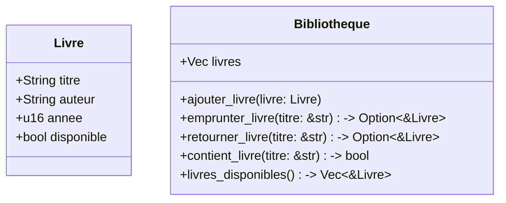

# Hexagone - TP Rust

Deux struct : `Livre` et `Bibliotheque`.

La logique d'affichage et d'input utilisateur est volontairement séparée dans des fonctions dédiées dans un souci de responsabilité unique pour les struct crées.

Pour simplifier la construction de `Bibliotheque` et éviter de passer un tableau vide à chaque fois, on dérive le trait `Default` pour cette struct.

L'affichage des livres se fait simplement en dérivant le trait `Debug` pour la struct `Livre` (ce qui m'a fait désactiver les warnings dead_code).

Pour le fun, j'ai ajouté un mini pipeline GitHub Actions qui compile le projet à chaque push Git, et j'ai ajouté plusieurs optimisations de compilation dans les fichiers `Cargo.toml` et `.cargo/config.toml` (ciblage de l'architecture CPU native, optimisation plus aggressive, etc).
